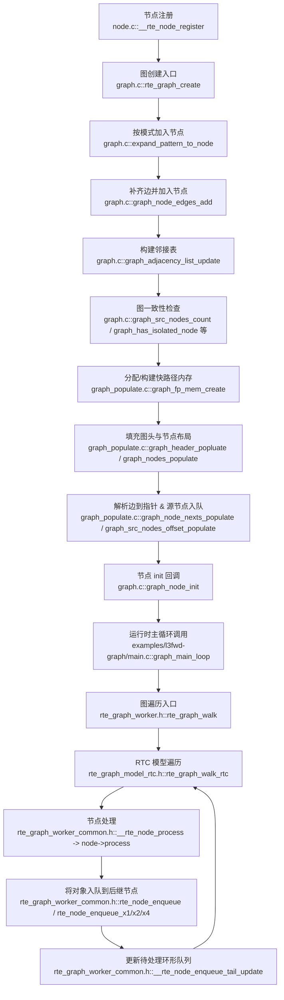
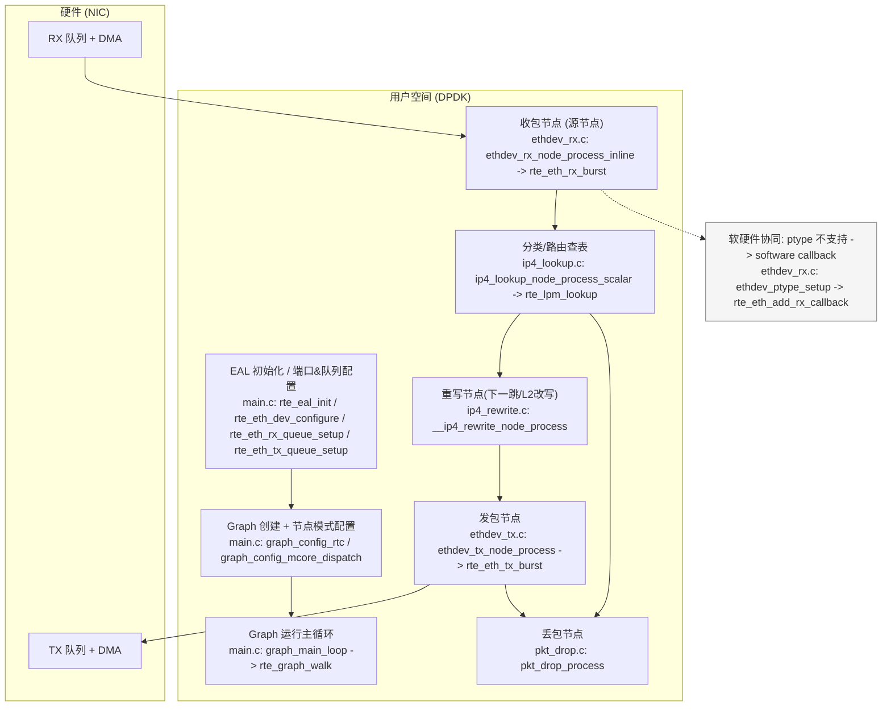
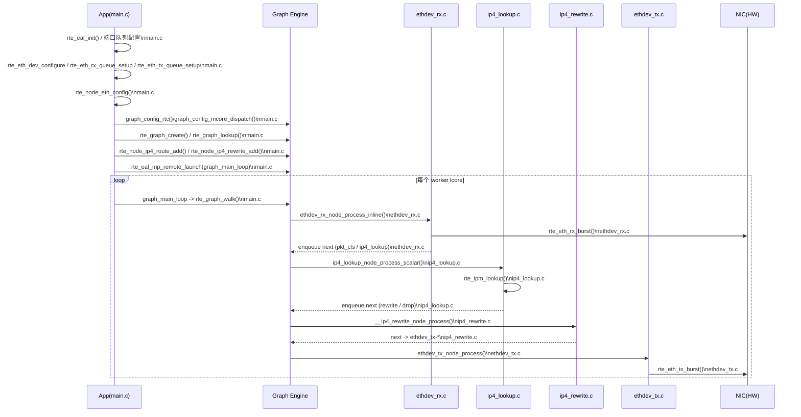

# DPDK Graph 相关问答归档

> 归档范围：本轮对话中围绕 DPDK Graph/L3FWD-Graph 的全部问答内容。

## 1. Graph 机制数据处理流程 + Mermaid 流程图（含文件名/函数名）

以下流程图覆盖 **节点注册 → 图构建/校验 → 快路径内存构建 → 运行时 walk/处理/入队** 的关键路径。

---

## 2. 核心数据结构与图论概念对应

| 数据结构 | 位置 | 图论对应 | 要点 |
|---|---|---|---|
| `struct node` | `graph_private.h` | 顶点（vertex） | 注册态节点，含 `name/nb_edges/next_nodes[]`。
| `struct graph_node` | `graph_private.h` | 顶点 + 邻接表 | `adjacency_list[]` 为邻接表。
| `struct graph` | `graph_private.h` | 图（graph） | 记录节点列表、源节点数量、内存布局等。
| `struct rte_graph` | `rte_graph_worker_common.h` | 图的运行时状态 | 环形队列 `head/tail/cir_start` 负责调度。
| `struct rte_node` | `rte_graph_worker_common.h` | 顶点（运行态） | `nodes[]` 为下一跳节点指针数组。
| `rte_node_enqueue*` | `rte_graph_worker_common.h` | 沿边传播 | 将对象流送入后继节点并推进调度。

---

## 3. Graph 机制实际应用价值与落地项目概览

### 3.1 实际应用价值
- 可将包处理逻辑拆解为可复用节点，并以图形式拼装。
- 快路径布局与环形调度提升吞吐、降低调度开销。
- 支持 RTC 与跨核调度模型，适合多核场景。

### 3.2 公开资料项目（含链接）
- **Open vSwitch with DPDK (OVS-DPDK)**
  - 关联点：OVS 可使用 DPDK datapath 完全用户态运行，适合作为 Graph 节点化数据面的集成场景。
  - 文档：https://docs.openvswitch.org/en/latest/intro/install/dpdk/
- **DPDK Graph Library 文档**
  - 关联点：官方 Graph Library 设计与内建节点说明。
  - 文档：https://doc.dpdk.org/guides/prog_guide/graph_lib.html

---

## 4. 按模式加入节点：支持的模式类型、区别与适用场景

- **只支持 Shell Pattern（`fnmatch` 的 shell 风格通配符）**。
- 模式差异主要体现在是否使用通配符：
  - **精确匹配**：不含通配符，等价于严格字符串匹配。
  - **通配匹配**：含通配符，适合批量匹配一类节点。

---

## 5. `examples/l3fwd-graph` 数据包转发流程图（含用户空间/内核空间、模块/机制）

> 该示例以 DPDK 用户态数据面为主；RX/TX 通过 DPDK 驱动访问 NIC 队列。硬件不支持 ptype 时会启用软件回调做补齐。

---

## 6. 完整数据包转发时序图（Mermaid，含文件名/函数名）

---

## 7. Graph walk 支持的模型遍历、差异与场景

- **RTC（Run-To-Completion）**：默认模型，单核内以环形队列调度节点，适合单核/低调度开销场景。
- **Mcore Dispatch**：跨核调度模型，依赖工作队列与内存池在多核之间分发节点流，适合多核负载均衡与跨核处理。

---

## 8. 公开资料清单（公司/组织 → 产品/项目 → DPDK/Graph 关联点）

| 公司/组织 | 产品/项目 | DPDK/Graph 关联点 | 外部来源 |
|---|---|---|---|
| Open vSwitch 社区 | Open vSwitch with DPDK | OVS 使用 DPDK datapath 完全用户态运行，适合 Graph 化数据面集成 | https://docs.openvswitch.org/en/latest/intro/install/dpdk/ |
| Linux Foundation DPDK 项目 | DPDK Graph Library 文档 | 官方 Graph library 机制/内建节点说明 | https://doc.dpdk.org/guides/prog_guide/graph_lib.html |

---

## 9. Graph 创建时节点模式支持说明（复述汇总）

- Graph 按模式加入节点只支持 **shell pattern**（`fnmatch` 风格通配符）。
- 常见用法：
  - 精确匹配：`"ethdev_tx-0"`
  - 通配匹配：`"ip4*"`、`"ethdev_tx-*"`

---

## 10. 备注

- 上述归档内容来源于对源码与公开文档的逐条分析。
- 如需扩展更多公司/产品/项目清单，请提供具体名单或方向。

